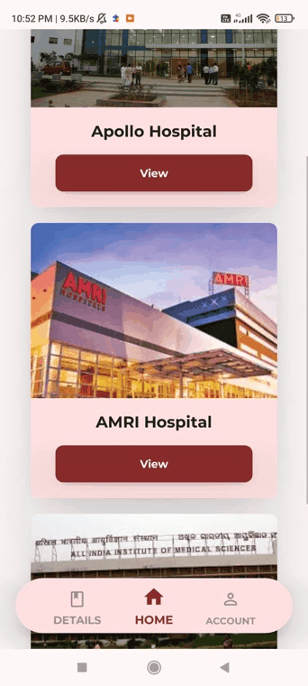
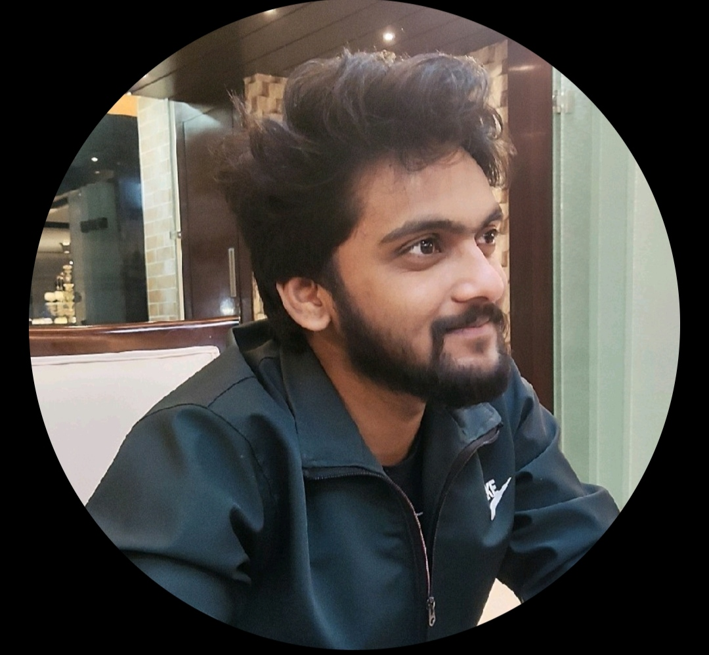

# RaktDan
  An application to serve as a medium of network between blood donors and patients & hospitals. The app aims to simplify the process of blood donation by introducing a 	digital approach to the tradition model.

## Inspiration

   Our Inspiration came from the fact that in India there are many deaths due to blood shortage on a daily basis. In such case if we could make a service which can bring 		all donors to the same platform and where we can organize them such that whenever their is a shortage of Blood in an area , Then a request can be sent to all donors     within a diameter range of 60km, so that who ever seems to be available might go and donate ,thus saving someone's life.    

   Also [Team Svassthy](https://github.com/Pavitra554/Svaasthy) who made a health app for Covid paitients inspired us to begin our journey.
	
## App Visuals

   

	
   

	
   

	
   

	

## 💻 What it does
 - Users can use the apps Update feature to stay updated about requirements of blood donation Area
 - Users can also make use of the  Nearby Hospitals feature to look for closest hospitals near them whenever an medical emergency arises
 - The app provides badges to donors after completion of certain milestones which will give access to special goodies in order to encourage Donors to donate Blood
 - We have plans to partner Hospitals and other blood donation related organization so that they can actively look for donors through our app which will help their paitients specially those who require blood transfusions immediately 

## User Information?
 * A Voluntary Donor has to make an account on our app with some general information like:
    - Name(via Google Cloud)
    - Blood Group
    - Aadhar ID
    - Location [Manually].

## ⚙️How we built it

- App: KivyMD
- Backend: FastApi
- Database: CockroachDB
- Authentication: Google Auth

## Use of Google Cloud
   We used Google Cloud for authentication of our users and also for sending Notifications to our app using <b>Cloud functions</b>. 

## 🧠 Challenges we ran into

- For this app we wanted to build it using a new technology just to stand out from the usual bias of using either Flutter or Android Native. KivyMd was the alternative which gave us not only the option to build an App but also a way to use our previously learnt language in a better way. But due to its less resources we had to strrugle to implement certain features like Google Auth, FCM notifications and Map(which we had to scrap of plan). Plus this being our first App hackathon we had to pace ourselves Up inorder to meet the submission deadline. 

## 🏅 Accomplishments that we're proud of
- The fact we made this app on a new technology without any prior experience of using cloud functions.
- The idea of using notifications instead of email or SMS(which today are straight up ignored).
- Completing all these features in just two days is another.

## 📖 What we learned

- Using Google Cloud Fuctions with Android Apps.
- Generating Notifications in KivyMD 
- Building and API End-point using FastApi

## 🚀 What's next for RaktDan

  - A Partner App where hospitals can request donors for blood when ever there is a shortage and the information will be shown here in RaktDan User app.
  - Integration of other medical requirements in the app so that we can help paitients when ever they have a medical problem.
  - A better way to send notifications and the use of an ML model to predict most and least blood availability areas.

## Real time usecases of the project

1) A medium of connection between Blood Donors and Patients.
   - This app will reduce the operations time of blood donation process and thus providing a more feasible approach.
2) Prevent wastage of blood
   - The app will have a huge impact on the wastage of blood units in medical colleges & hospitals as it can be a replacement for the storage based blood donation system.

## Contributing

 

<h2 align="center"><b>Contributors 🫂</b></h2>

<table align="center">

 <tr>
    <td align="center">
        
         <b>Ashutosh Mahapatra</b> 
      
      
      </td>
</tr>
<tr>
    <td align="center">
        
         <b>Rohit Patel</b> 
      
      
      </td>
</tr>
  <tr>
    <td align="center">
        
         <b>Pragati Saikia</b> 
      
      
      </td>
</tr>
 <tr>
    <td align="center">
        
         <b>Jyotiraditya Kuanar</b> 
      
      
      </td>
</tr>
</table>

 

#### Find the project useful?? Star ⭐ this Repo. 🤩
